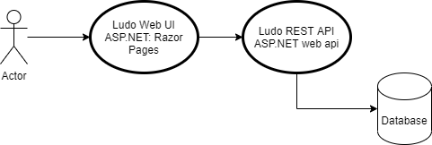

# Fia webbapplikation




Målet i detta projekt är att bygga ett grafisk web version av Ludo et spel och att denna webbapplikation ska använda REST API till styra al logik och data.

I den webbapplikation som vi ska bygga är planen att vi ska använda så många av dom teknikker som vi har lärt båda under denna kurs men också under Webbutveckling Frontend.

## Grundtanken 
Det ska vara möjligt att spela spelet för mellan två och fyra spelare, "sittande på varje sin dator" (detta kräver en server som alla kommer åt, man kan altivernativt har flera webbläsere öppna på datorn).

Det ska bara möjligt att starta fler samtidiga spel, på servern, och komma åt ett spel med en given länk.

# Krav till projektet

Allt ni göra, skall göras i ert GitHub repo (båda kod och dokumentation), som ligger på ert Team. Ni skall använda en ["commit tidigt och ofta"](https://blog.codinghorror.com/check-in-early-check-in-often/) ([1](https://sethrobertson.github.io/GitBestPractices/)) strategi, såklart bör ni endast commita kod som kan kompileras.

## Dokumentation

Dokumentation är till andra utvecklare och måste ge en introduktion till systemet, vilka delar består det av?

Frivilliga element MÅSTA framgå av dokumentationen

Se till att skriv och uppdatera eran [user stories](https://www.mountaingoatsoftware.com/agile/user-stories) (i docs mappen) eller issues (i Github), så att dom passer med eran Web App. Om ni använder någon externa källor (båda kod och annat) ange dom i dokumentationen.

Dokumentation skrivas med markdown (.md), ni väljer själv om ni vill skriva på svenska eller engelska, enda krav är att filerna placeras i */docs* mappen. Vissa delar kan vara svåra att beskriva med text och till dissa kan man med fördel för med bilder, bilder läggs också i docs-mappen och använder ni markdown kan ni länka till dom.

```markdown

```

Se till att man kommer åt al dokumentation från *docs/readme.md*. Så att ni i readme.md länker till andre dokument.

## Programmering
I detta projekt ska ni implementera en Web App till ert FLudo spel. Spelet ska vara en ASP.NET Core Web Application (Razor pages).

Kod ska ligga i mappen **src**, varje team får enbart ha **en kodbas**. 

# Hints
Börja med i teamen med att göra en förväntningsavstämning, vad är erat mål i team, och vad är er individuella styrkor.

Försök att undvika att någon i teamen är syssellösa, om där är samarbetsvanskligheter se till att ta i dom så tidigt som möjligt.

Om någon i gruppen har svårt vid delar av koden, försök att köra pair-programming, och se till at den om tycker det är svårt är [Driver](https://gist.github.com/jordanpoulton/607a8854673d9f22c696)

Använd Github aktivt: Issues, Pull requets, Projects. Det gör det enklare för alla hänga med på alla förändringar och idéer.

Försöka att följa SOLID principerna så långt det går.

## Kom igång
1. Beskriv med user stories eller issues vad ni förvänter att en använder ska kunna i ert fia spel
2. Implementera ett LUDO REST Api
   * ASP.NET Core Web API (webapi)
   * Unitest + unitest
3. Skåpa en Razor Page applikation
   * ASP.NET Core Web App (webapp)
   * Unittest + Unitetst 

# Betygsättning
Detta projekt är betygsgrundande, och startas måndag den 10:e maj 2021.

Det är dokumentation och kod som är commitat main-branchen innan fredag den 28:e maj 2021 kl 23:55 som räcknas.

## Branching och pull request
Ni kan göra så många branches baseret på *main* som ni önsker. När projektet är slut är det innehållet av **main** på **GitHub** som räcknas, så ni behöver att göra ett pull request eller merge från eran branch(s) till *main* innan deadline (om ni gör ett pull request kom ihåg att det måste appovas innan filerna hamnar i main).

## Minimum krav
* Spellogiken styres av ett REST API, och spelen spara i en databas
* En enkelt grafisk (kan vara text formateret med HTML) repräsentation av spilbräddan med en Razor View (med Razor Pages)
* Input ska vära valideret, i princip ska alla input till controlers valideras i APIet och till modellen i pages, t.ex. om ett input är antal spelera kan man göra en validering som kolla om man har skrivit en sifre emellan 1 och 4. 
* Databas körs i en docker compose
* Varje Ludo spel har en unik URL, t.ek (välj en av dissa alternativ):
  * med ett ID: https://localhost:5001/ludo/4/
  * med en GUID: https://localhost:5001/ludo/1c1707cb-86fe-4cce-8ce2-06cd2d16f851/
  * med en namn: https://localhost:5001/ludo/fiaspel2344/

## Frivilliga element
För att ett element räckans med i bedömningen ska det de bekrivas i docs mappen. Gör ett matchande dokument med en beskrivning, namnet på dokumentet är angivet under varje kriterium, med ett förslag till vad innehållet av filen kan innehålla (filen måste vara ett markdown dokument).

* Deployas till en webserver 
  * *docs/link.md*, hur har progammet deplyas, och vad är länken.
* Inlogning, som är inplementerat med ASP.NET core [authentication och autherization](/PGBSNH20-backendweb/lectures/aaa-i18n)
    * *docs/vg_auth.md*, hur kan användern logga på? hur sparas data?
* Möjlighet att bjuda in/utmana flera spelere via epost, använn en tjänst som [SendGrid](https://sendgrid.com) tiill detta
    * *docs/vg_email.md*, vilken service använns?
* Spelets pjäserna på spelet ska uppdateras automatisk via [SignalR](/PGBSNH20-backendweb/lectures/asyncweb) eller en annan async teknologi (som webhooks)
    * *docs/vg_async.md*, ett diagram som viser dataflowet
* Stöd för fler språk/kultur (eg. Svenska och engelska) i webbgränssnittet, baseret på vad som är konfigureret i webläseren eller vid login
    * *docs/vg_i18n.md*, vilka internationaliserings funktioner har ni använt
* Responsive UI, så att Ludo-spelet funkar även på mobil
    * *docs/vg_responsive.md*
